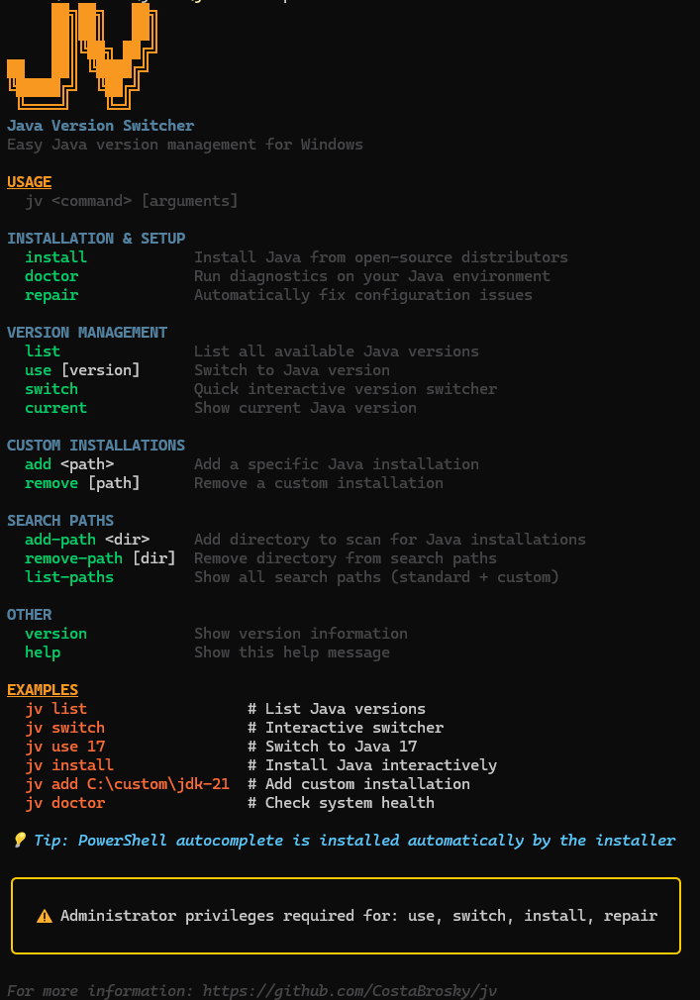

# Java Version Switcher (jv)

<p align="left">
  
</p>

[](https://www.microsoft.com/windows)
[](https://go.dev/)
[](LICENSE)

A fast CLI for switching Java versions on Windows. It detects installed JDKs, lets you pick one interactively, and updates `JAVA_HOME` and `PATH` accordingly. 

Interactive UIs are built with the [Charm toolkit](https://github.com/charmbracelet) (Huh for prompts, Lip Gloss for styling).

## Install

### PowerShell script (recommended)

Use the provided installer script. It places `jv.exe` in a user‑friendly location (XDG Standards), updates PATH if needed, creates the config, and enables PowerShell autocomplete by default.

```powershell
irm https://raw.githubusercontent.com/CostaBrosky/jv/main/install.ps1 | iex
```

### Manual (build from source)

```powershell
git clone https://github.com/CostaBrosky/jv.git
cd jv
go build -ldflags="-s -w" -o jv.exe .
# Copy jv.exe to a directory in PATH (e.g. C:\tools)
```

## Quick usage

```powershell
jv list          # List versions
jv switch        # Interactive switcher (arrows, Enter)
jv use 17        # Switch directly to 17
jv current       # Show current JAVA_HOME/version
jv install       # Install Java interactively
jv doctor        # Diagnostics
jv repair        # Guided fixes

# Custom entries and search paths
jv add C:\custom\jdk-21
jv remove        # Interactive removal of custom entries
jv add-path C:\DevTools\Java
jv remove-path   # Interactive removal of search paths
```

## Features

- Interactive TUI for selection and confirmation
- Styled output with clear status messages
- Auto‑detection of Java installations
- Persistent configuration of custom/search paths
- Permanent switching via system environment variables
- Built with [Charm](https://github.com/charmbracelet) (Huh prompts, Lip Gloss styles)

## Screenshots 



## Administrator privileges

`jv use`, `jv switch`, `jv install`, and `jv repair` may require Administrator privileges to modify system‑wide environment variables. Run the terminal as Administrator when needed.
The installer script does not require admin; it configures user‑level PATH and autocomplete.

## Compatibility

- Windows 10/11
- PowerShell (recommended)
- Go 1.21+ only if building from source

## Support

- Issues and feature requests: open an issue on GitHub.

## Changelog

- See `CHANGELOG.md` for release notes.

## Uninstall

### Script (recommended)

Removes the executable, user PATH entry, config, and PowerShell autocomplete.

```powershell
irm https://raw.githubusercontent.com/CostaBrosky/jv/main/uninstall.ps1 | iex
```

Or run locally from the repo:

```powershell
./uninstall.ps1
```

### Manual

Delete `jv.exe` from your tools directory and optionally remove `%USERPROFILE%\.config\jv\jv.json`. You may also remove the tools directory from your user PATH and the jv completion block from your PowerShell profile.

## License

MIT. See `LICENSE`.
